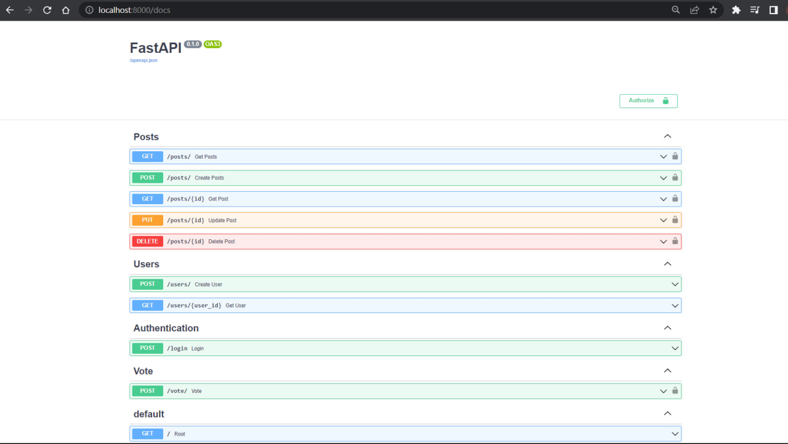

# Social Network API
---
## Core stack: Python + FastAPI + PostgreSQL + Alembic + PyTest
---
# Usecases

## 1. Post router
### *Create, delete, update posts*
## 2. User router
### *Create user, get user information by his UID*
## 3. Authentication router
### *Login into system*
## 4. Vote router
### *Vote system for posts*
---
# How to run locally
### Clone this repository via git clone

````

git clone https://github.com/pashathecreator/Social-network-API.git

````

### Go to repo's directory

````

cd Social-network-API

````

### Install requirements.txt using this command

````

pip install -r requirements.txt

````

### Run by this command

````

uvicorn main:app --reload

````

### Or by using Docker Compose + Makefile


````

make up-dev

````

### Then go to 

````

http://127.0.0.1:8000/docs

````

### There is Swagger UI docs of this project



### After that you need to specify .env file simillar to this

````
DATABASE_HOSTNAME=localhost # if you using manual uvicorn run
DATABASE_HOSTNAME=postgres # if you using docker
DATABASE_PORT=5432
DATABASE_PASSWORD=12345
DATABASE_NAME=fastapi
DATABASE_USERNAME=postgres
SECRET_KEY=09d25e094faa6ca2556c818166b7a9563b93f7099f6f0f4caa6cf63b88e8d3e7
ALGORITHM=HS256
ACCESS_TOKEN_EXPIRE_MINUTES=30
POSTGRES_PASSWORD=12345
POSTGRES_DB=fastapi
````
### Notice, that you need to generate SECRET_KEY by yourself
### For that you can use this command and get your's key

````

openssl rand -hex 32

> 09d25e094faa6ca2556c818166b7a9563b93f7099f6f0f4caa6cf63b88e

````

## After all of this you can test this app via PyTest

### Install PyTest
````

pip install pytest

````

### Then run it via this command

````

pytest

````
&ensp;
## Notice, some steps may be not valid for you, so just specify it for your cases!

&ensp;

## You can also deploy it on your ubuntu server by using GitHub Actions and build-deploy.yml file
### 1. Specify your secret keys
### 2. Push or Pull your code to run Actions